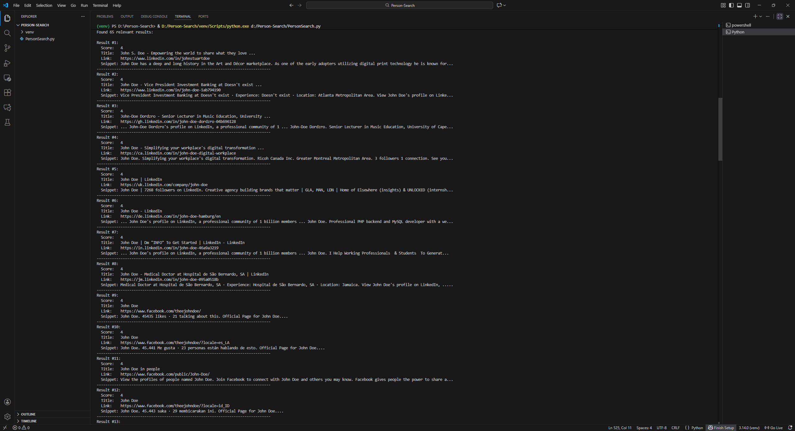

# 🔍 Person Search Tool

A Python-powered profiling assistant that searches for public person profiles across major social platforms using intelligent name parsing, fuzzy matching, and dual-engine search aggregation.

## ✨ Features

✅ Searches across LinkedIn, Facebook, and Instagram  
✅ Intelligent name parsing using nameparser  
✅ Fuzzy matching of usernames and text using rapidfuzz  
✅ Dual search engine pipeline (Google CSE + DuckDuckGo)  
✅ Relevance scoring with platform weighting  
✅ Automatic duplicate filtering  
✅ Username extraction directly from URLs  

## 🚀 Quick Start

### Prerequisites

- Python 3+
- Internet connection
- Optional but recommended: Google Custom Search Engine API key (public key included but limited to ~100 queries/day)

## 🛠️ Installation & Setup

### Clone the repository
git clone https://github.com/ssbodea/Person-Search.git  
cd Person-Search

### Create and activate a virtual environment

#### Windows
python -m venv venv  
venv\Scripts\activate

#### macOS / Linux
python3 -m venv venv  
source venv/bin/activate

### Install required packages
pip install -r requirements.txt

If no requirements file exists:
pip install requests nameparser rapidfuzz duckduckgo-search

## 🔑 Google API Setup (Optional)

### 1. Create an API key  
https://console.cloud.google.com/apis/credentials

### 2. Create a Custom Search Engine  
https://cse.google.com/cse/all

### 3. Enable full web search  
Enable “Search the entire web”

## ▶️ Running the Tool

python PersonSearch.py

You will be prompted to enter:

✅ Name to search  
✅ Optional extra context such as:  
- city  
- education  
- occupation  

Example input:
London, software, university

## 📌 Example Output

Searching for "John Smith"...

Found 7 relevant results:

Result #1:  
Score:   5  
Title:   John Smith - LinkedIn  
Link:    https://www.linkedin.com/in/johnsmith  
Snippet: Professional engineer based in London...  
--------------------------------------------------------------------------------

## 📂 Project Structure

Person-Search/  
├─ PersonSearch.py  
├─ images/  
│   └─ screenshot.png  
├─ requirements.txt  
└─ README.md  

## 🧠 Skills Learned During Development

### Technical Skills
- Google Custom Search API integration
- DuckDuckGo supplemental search integration
- Regex and URL parsing
- Username extraction logic
- Fuzzy scoring methodology
- Deduplication strategy
- Logging and debugging for OSINT tooling
- Handling environment variables securely
- Name parsing with initials and variants

### Python Libraries Applied

requests — API networking  
nameparser — splitting human names intelligently  
rapidfuzz — fuzzy matching and scoring  
duckduckgo-search — supplementary search source  
urllib.parse — URL breakdown and extraction  
logging — diagnostic output  
dataclasses — structured data containers  

## 🧩 Planned Enhancements

- Exporting results to CSV and JSON
- Multi-threaded search execution
- Result confidence ranking
- Browser-based UI
- Caching to avoid repeated queries
- OSINT reporting formatting templates
- Bot version (Telegram or Discord)

## 🛡️ Ethical & Legal Notes

This tool is intended for:

✅ OSINT research  
✅ Recruitment verification  
✅ Personal digital footprint awareness  
✅ Cybersecurity exposure checks  

Prohibited use includes:

❌ stalking  
❌ harassment  
❌ doxxing  
❌ scraping private or restricted data  

Users are responsible for complying with local privacy regulations.

## ⭐ Contribute

Feature ideas and pull requests are welcome.

## 📜 License

MIT License
